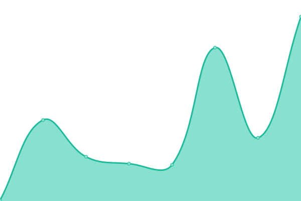

# [📈 Live Status](https://status.foresightmining.com): <!--live status--> **🟩 All systems operational**

This repository contains the open-source uptime monitor and status page for [Foresight Mining Software Corporation](https://www.foresightmining.com/), powered by [Upptime](https://github.com/upptime/upptime).

With [Upptime](https://upptime.js.org), you can get your own unlimited and free uptime monitor and status page, powered entirely by a GitHub repository. We use [Issues](https://github.com/ForesightMiningSoftwareCorporation/upptime/issues) as incident reports, [Actions](https://github.com/ForesightMiningSoftwareCorporation/upptime/actions) as uptime monitors, and [Pages](https://status.foresightmining.com) for the status page.

<!--start: status pages-->
<!-- This summary is generated by Upptime (https://github.com/upptime/upptime) -->
<!-- Do not edit this manually, your changes will be overwritten -->
<!-- prettier-ignore -->
| URL | Status | History | Response Time | Uptime |
| --- | ------ | ------- | ------------- | ------ |
|  Production server | 🟩 Up | [production-server.yml](https://github.com/ForesightMiningSoftwareCorporation/upptime/commits/HEAD/history/production-server.yml) | 

 228ms
     
 | 

<a href="https://status.foresightmining.com/history/production-server">100.00%</a>
    

|  Whirlpool updates | 🟩 Up | [whirlpool-updates.yml](https://github.com/ForesightMiningSoftwareCorporation/upptime/commits/HEAD/history/whirlpool-updates.yml) | 

 113ms
     
 | 

<a href="https://status.foresightmining.com/history/whirlpool-updates">100.00%</a>
    

|  Development server | 🟩 Up | [development-server.yml](https://github.com/ForesightMiningSoftwareCorporation/upptime/commits/HEAD/history/development-server.yml) | 

 235ms
     
 | 

<a href="https://status.foresightmining.com/history/development-server">100.00%</a>
    

|  CI | 🟩 Up | [ci.yml](https://github.com/ForesightMiningSoftwareCorporation/upptime/commits/HEAD/history/ci.yml) | 

 1719ms
     
 | 

<a href="https://status.foresightmining.com/history/ci">90.74%</a>
    

<!--end: status pages-->

[**Visit our status website →**](https://status.foresightmining.com)

## 📄 License

- Powered by: [Upptime](https://github.com/upptime/upptime)
- Code: [MIT](./LICENSE) © [Foresight Mining Software Corporation](https://www.foresightmining.com/)
- Data in the `./history` directory: [Open Database License](https://opendatacommons.org/licenses/odbl/1-0/)
